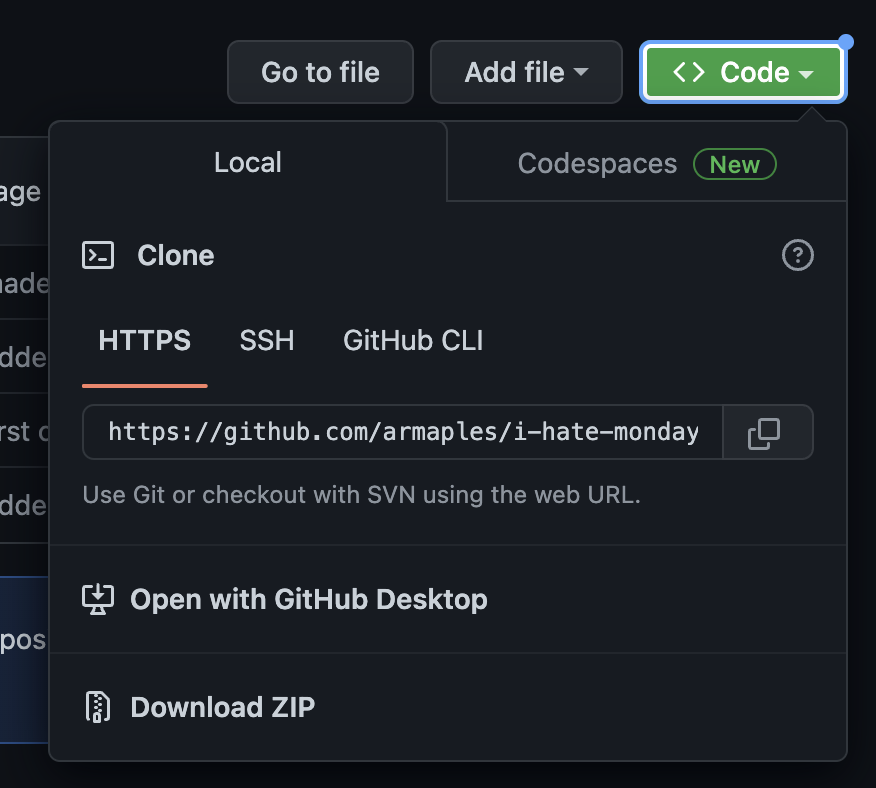
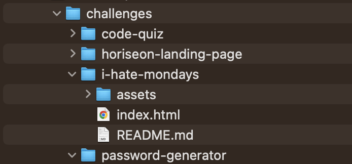
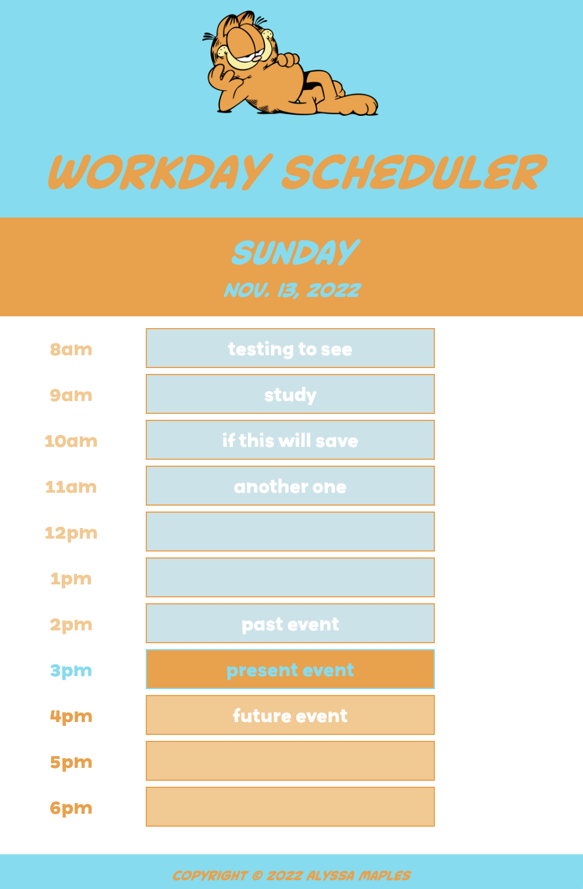
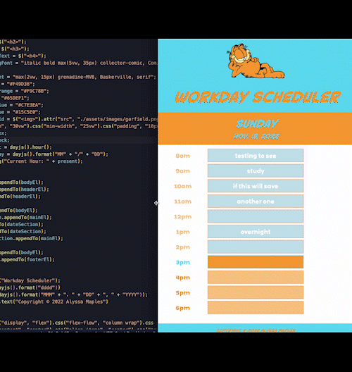
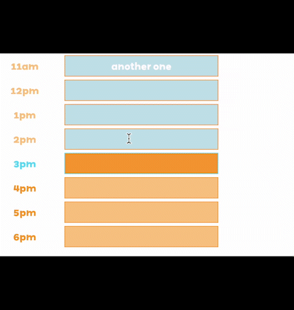
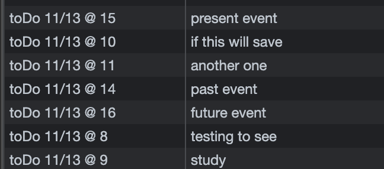

# Garfield Daily Scheduler

## Description
 

## Table of Contents

- [Installation](#installation)
- [Application Preview](#application-preview)
- [Languages Used](#languages-used)
- [Important Links](#important-links)
- [Credits](#credits)
- [License](#license)
    - [MIT License](#mit-license)

## Installation

- Navigate to the 'clone' button on the github repository and use either SSH or HTTPS link to clone the repository to your computer.

- On your computer, navigate to the 'password-generator' directory and open the index.html file in your browser. 

## Application Preview

- Above is a screenshot of what the page looks like.

- The page is responsive and elements will adjust depending on size.

- When you begin typing in the box, the save button will appear. When you click the save button, it will log the information and hide again.

- The text color and background color will adjust based on whether the hour is in the past, present, or future.

- The information entered will save in the local storage with their month, day, and hour.

## Languages Used

- HTML
- CSS
- Javascript
- jQuery

## Important Links

- [Github Repository](https://github.com/armaples/i-hate-mondays)
- [Deployed Application](https://armaples.github.io/i-hate-mondays)

## Credits
- [Professional README Guide](https://coding-boot-camp.github.io/full-stack/github/professional-readme-guide) 
- [Choose A License](https://choosealicense.com/licenses/mit/)
- [Adobe Fonts](https://fonts.adobe.com/)
- [Garfield PNG Credit](https://www.nicepng.com/ourpic/u2a9o0o0q8e6o0q8_garfield-the-cat-animated-garfield/)

## License

### MIT License

Copyright (copy) 2022 Daily Scheduler - Alyssa Maples

Permission is hereby granted, free of charge, to any person obtaining a copy
of this software and associated documentation files (the "Software"), to deal
in the Software without restriction, including without limitation the rights
to use, copy, modify, merge, publish, distribute, sublicense, and/or sell
copies of the Software, and to permit persons to whom the Software is
furnished to do so, subject to the following conditions:

The above copyright notice and this permission notice shall be included in all
copies or substantial portions of the Software.

THE SOFTWARE IS PROVIDED "AS IS", WITHOUT WARRANTY OF ANY KIND, EXPRESS OR
IMPLIED, INCLUDING BUT NOT LIMITED TO THE WARRANTIES OF MERCHANTABILITY,
FITNESS FOR A PARTICULAR PURPOSE AND NONINFRINGEMENT. IN NO EVENT SHALL THE
AUTHORS OR COPYRIGHT HOLDERS BE LIABLE FOR ANY CLAIM, DAMAGES OR OTHER
LIABILITY, WHETHER IN AN ACTION OF CONTRACT, TORT OR OTHERWISE, ARISING FROM,
OUT OF OR IN CONNECTION WITH THE SOFTWARE OR THE USE OR OTHER DEALINGS IN THE
SOFTWARE.